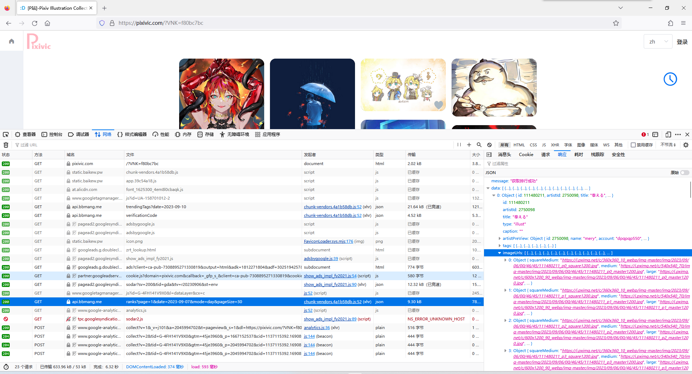
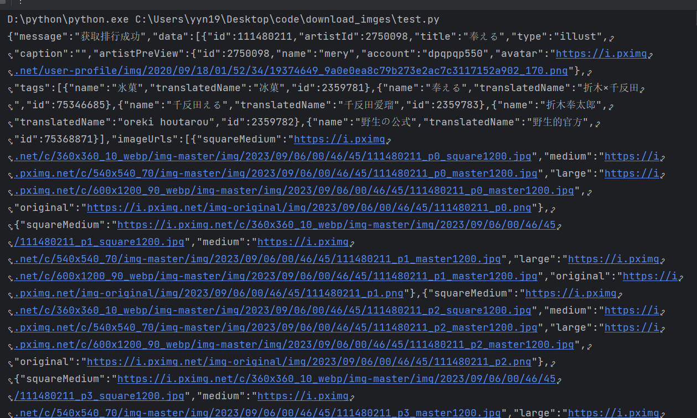
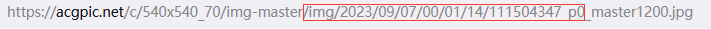
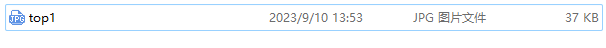
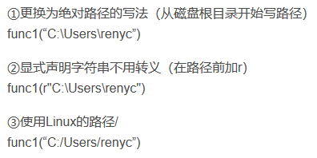

#### 1.发送请求

首先通过f12检查网站传输的包，发现ranks文件，查看其api所对应的响应，可以找到图片的url下载地址：



于是我们就可以向这个api发送请求：

```python
import requests
url = "https://api.bbmang.me/ranks?page=1&date=2023-09-07&mode=day&pageSize=30"
reponse = requests.get(url)
print(reponse)  #返回<Response [200]>
```

因为返回值为200，说明服务器已经同意请求，并通过reponse.text发现其返回值是标准的json文件，没有出现乱码等反爬现象，因此不用再加入请求头。

#### 2.解析数据

返回数据长这个样子：



##### json使用

这就是标准的json形式文件，但还不是一个字典(其实很像)，所以我们要通过response.json()指令将其变成一个字典，这样才可以通过字典与列表的操作方式提取数据。

我们可以看到里面的数据其实就是字典与列表的不断嵌套，所以只要一点点剥下去即可：

```python
response.json()["data"][0]['imageUrls'][0]['original']
#返回为https://i.pximg.net/img-original/img/2023/09/06/00/46/45/111480211_p0.png
#就是日排行第一的图
```

但是当你将网站复制进浏览器时你会发现打不开。

##### url拼接

也许是因为这个url是p站之前的使用方法，这时通过与现在图片的打开地址进行比对可以看到其中可以进行暴力拼接




图中方框处就是相同的部分，因此我们可以通过列表的切片将其拼接，这样我们就可以得到可以用的图片下载url了。

#### 3.下载图片至本地

目前我们已经得到了今天top1的图片url，我们再通过request请求获取图片数据，然后就可以把图片下载到本地了：

```python
img_url = "https://acgpic.net/c/540x540_70/img-master"+response.json()["data"][0]['imageUrls'][0]['original'][32:-4]+"_master1200.jpg"

img = requests.get(img_url)
with open("./top1.jpg","wb") as f:  #"wb"是以二进制写入
	f.write(img.content)  #content是指获取二进制内容
```

此时你已经可以看到top1的图片下载当前文件夹了。



同理，下载前十的图片只需要加入for循环就可以了，以下省略。

#### 4.下载至指定文件夹

这里就需要导入os包：

```python
import os
path = 'C:/Users/yyn19/Desktop/code/download_imges/2023-9-7'  #这是我的绝对地址
if(os.path.exists(path)==False):  #判断是否存在该文件夹
    os.mkdir(path)  #创建该文件夹，文件夹名字为2023-9-7
```

##### path书写

这其中的path是linux写法书写，为了方便我进行字符串拼接，这其中path也有三种写法：



第二条中的r是用来申明不是转义字符。

这样就可以创建一个文件夹了~

然后只要再with open() as中加入path路径就可以将其下载到指定文件夹中了。

#### 5.关于api中日期的变化

因为每天api的地址都会更新，这里我就用了datetime包来获取时间信息，我发现api中的日期都会比我们现在的时间少3天，因此只要一下操作就能获取api中的时间日期：

```python
import datetime
day = datetime.date.today()
api_day = day-datetime.timedelta(days=3)
```

然后只需要再拼接如url中就可以啦~
